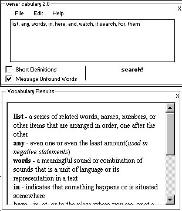



## Venacabulary 2\.0

### Description

This code inputs a list of any amount of words seperated by commas and goes to the internet and gets the definitions for the words from an online DICTIONARY. you can select short definitions or long ones, you can have the program message you when it cant find words, it also makes it easy to copy the words and definitions into a word processor. GREAT CODE, try this out if you want to learn about screen scraping.
 
### More Info
 
words seperated by commas

words and definitions

             |
---                |---
**Submitted On**   |2001-01-13 11:17:48
**By**             |[matt venables](https://github.com/Planet-Source-Code/PSCIndex/blob/master/ByAuthor/matt-venables.md)
**Level**          |Intermediate
**User Rating**    |5.0 (10 globes from 2 users)
**Compatibility**  |VB 5\.0, VB 6\.0
**Category**       |[Internet/ HTML](https://github.com/Planet-Source-Code/PSCIndex/blob/master/ByCategory/internet-html__1-34.md)
**World**          |[Visual Basic](https://github.com/Planet-Source-Code/PSCIndex/blob/master/ByWorld/visual-basic.md)
**Archive File**   |[CODE\_UPLOAD15664312001\.zip](https://github.com/Planet-Source-Code/matt-venables-venacabulary-2-0__1-21429/archive/master.zip)

